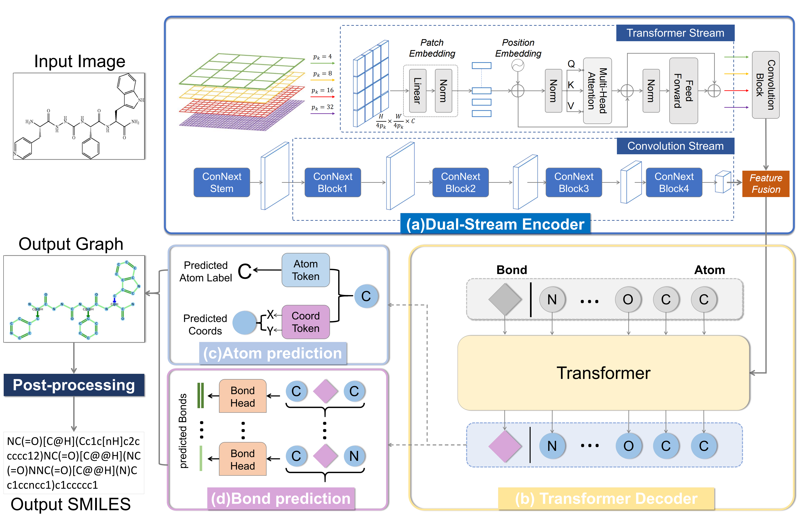
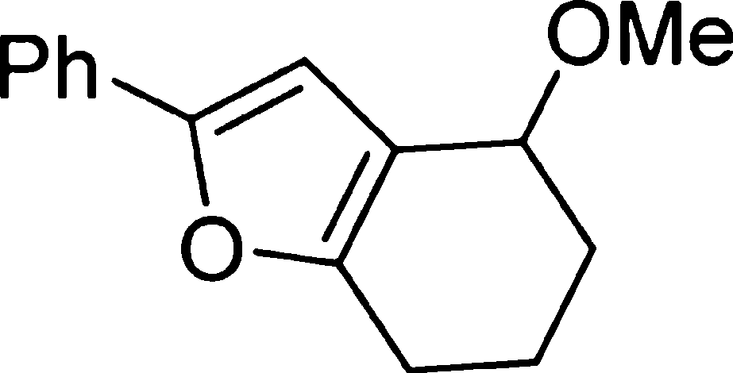
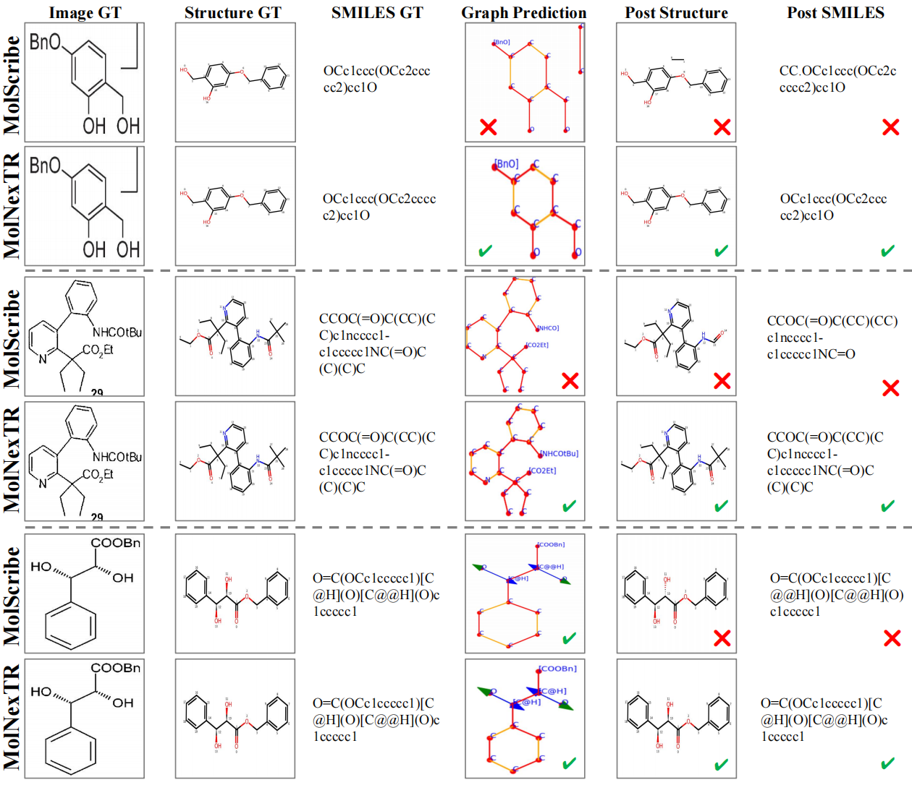
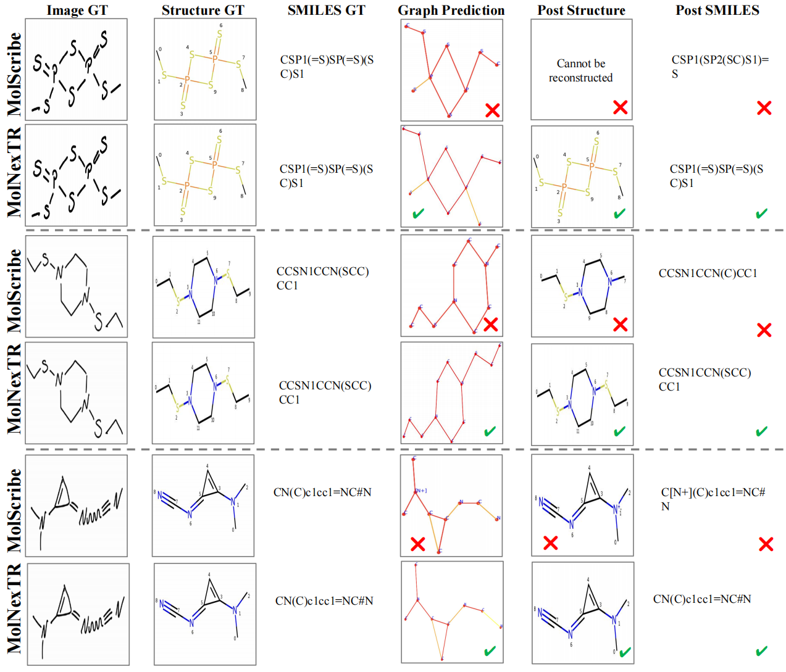

# MolNexTR [](https://doi.org/10.5281/zenodo.13857412)
This is the official code of the paper "MolNexTR: a generalized deep learning model for molecular image recognition".

## :sparkles: Highlights
<p align="justify">
In this work, We propose MolNexTR, a novel graph generation model. The model follows the encoder-decoder architecture, takes three-channel molecular images as input, outputs molecular graph structure prediction, and can be easily converted to SMILES. We aim to enhance the robustness and generalization of the molecular structure recognition model by enhancing the feature extraction ability of the model and the augmentation strategy, to deal with any molecular images that may appear in the real literature.

[comment]: <> ()

<div align="center">
Overview of our MolNexTR model.
</div> 

## :rocket: Using the code and the model
### Using the code
Clone the following repositories:
```
git clone https://github.com/CYF2000127/MolNexTR
```
### Example usage of the model
1. First create and activate a [conda](https://numdifftools.readthedocs.io/en/stable/how-to/create_virtual_env_with_conda.html) environment with the following command in a Linux, Windows, or MacOS environment (Linux is the most recommended):
```
conda create -n molnextr python=3.8
conda activate molnextr
```

2. Then Install requirements:
```
pip install -r requirements.txt
```
Alternatively, directly use the following command:
```
conda env create -f environment.yml
```


3. Download the model checkpoint from our [Hugging Face Repo](https://huggingface.co/datasets/CYF200127/MolNexTR/blob/main/molnextr_best.pth) or Zenodo Repo: [](https://doi.org/10.5281/zenodo.13304899) and put in your own path 

4. Run the following code to predict molecular images:
```python
import torch
from MolNexTR import molnextr
Image = './examples/1.png'
Model = './checkpoints/molnextr_best.pth'
device = torch.device('cpu')
model = molnextr(Model, device)
predictions = model.predict_final_results(Image, return_atoms_bonds=True)
print(predictions)
```
or use [`prediction.ipynb`](prediction.ipynb). You can also change the image and model path to your own images and models.

The input is a molecular image:

<div align="center",width="50">
Example input molecular image.
</div> 
The output dictionary includes the atom sets, bond sets, predicted MolFile, and predicted SMILES:

``` 
{
    'atom_sets':  [
                  {'atom_number': '0', 'symbol': 'Ph', 'coords': (0.143, 0.349)},
                  {'atom_number': '1', 'symbol': 'C', 'coords': (0.286, 0.413)},
                  {'atom_number': '2', 'symbol': 'C', 'coords': (0.429, 0.349)}, ... 
                  ],
    'bonds_sets': [
                  {'atom_number': '0', 'bond_type': 'single', 'endpoints': (0, 1)},
                  {'atom_number': '1', 'bond_type': 'double', 'endpoints': (1, 2)}, 
                  {'atom_number': '1', 'bond_type': 'single', 'endpoints': (1, 5)}, 
                  {'atom_number': '2', 'bond_type': 'single', 'endpoints': (2, 3)}, ...
                  ],
    'predicted_molfile': '2D\n\n 11 12  0  0  0  0  0  0  0  0999 V2000 ...',
    'predicted_smiles': 'COC1CCCc2oc(-c3ccccc3)cc21'
}   
```


## :fire: Experiments

### Data preparation
For training and inference, please download the following datasets to your own path.
#### Training datasets
1. **Synthetic:**  [PubChem](https://huggingface.co/datasets/CYF200127/MolNexTR/blob/main/train_pubchem.csv)
2. **Realistic:**  [USPTO](https://huggingface.co/datasets/CYF200127/MolNexTR/blob/main/train_uspto.zip)

#### Testing datasets
1. **Synthetic:**  [Indigo, ChemDraw](https://huggingface.co/datasets/CYF200127/MolNexTR/blob/main/synthetic.zip)
2. **Realistic:**  [CLEF, UOB, USPTO, JPO, Staker, ACS](https://huggingface.co/datasets/CYF200127/MolNexTR/blob/main/real.zip) 
3. **Perturbed by image transform:** [CLEF, UOB, USPTO, JPO, Staker, ACS](https://huggingface.co/datasets/CYF200127/MolNexTR/blob/main/perturb_by_imgtransform.zip)
4. **Perturbed by curved arrows:** [CLEF, UOB, USPTO, JPO, Staker, ACS](https://huggingface.co/datasets/CYF200127/MolNexTR/blob/main/perturb_by_arrows.zip)


### Train
Note: we recommend users to use linux to train the model.
Run the following command:
```
sh ./exps/train.sh
```
The default batch size was set to 256. And it takes about 20 hours to train with 10 NVIDIA RTX 3090 GPUs. Please modify the corresponding parameters according to your hardware configuration. 

### Inference
Run the following command:
```
sh ./exps/eval.sh
```
The default batch size was set to 32 with a single NVIDIA RTX 3090 GPU. Please modify the corresponding parameters according to your hardware configuration.
The outputs include the main metrics we used, such as SMILES and graph exact matching accuracy.

### Prediction
Run the following command:
```
python prediction.py --model_path your_model_path --image_path your_image_path
```
### Visualization
Use [`visualization.ipynb`](visualization.ipynb) to visualize the ground truth and the predictions.

We also show some qualitative results of our method below:


<div align="center">
Qualitative results of our method on ACS.


Qualitative results of our method on some hand-drawn molecular images.
</div> 

## ✅ Citation
Chen, Yufan, et al. "MolNexTR: a generalized deep learning model for molecular image recognition." Journal of Cheminformatics 16.1 (2024): 141.

```bibtex
@article{chen2024molnextr,
  title={MolNexTR: a generalized deep learning model for molecular image recognition},
  author={Chen, Yufan and Leung, Ching Ting and Huang, Yong and Sun, Jianwei and Chen, Hao and Gao, Hanyu},
  journal={Journal of Cheminformatics},
  volume={16},
  number={1},
  pages={141},
  year={2024},
  publisher={Springer}
}
```
